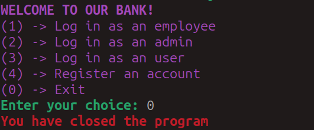

# Result screenshots of program

## Table of contents

### 1. [Introduction](../project-report.md#1-introduction)

### 2. [Objectives](../project-report.md#objectives)

### 3. [Scopes](../project-report.md#scope)

### 4. [Problem Definition](./problem-definition.md)

### 5. [Application Structure](./system-design.md#application-structure)

### 6. [Technologies used](./system-design.md#technologies-used)

### 7. [Architecure and Design](./system-design.md#architecture-and-design)

### 8. [Program screenshots results](./result-screenshoots.md)

---

## Launching the program (main panel)

## Employee - log in and displaying panel

### Employee panel - option 1 (Display data)

### Employee panel - option 2 (Dismiss from work)

## Admin - log in and displaying panel

### Admin Panel - option 1 (Display all users)

### Admin Panel - option 2 (Display all employees)

### Admin Panel - option 3 (Register a user)

### Admin Panel - option 4 (Hire an employee)

### Admin Panel - option 5 (Remove a user)

### Admin Panel - option 6 (Dismiss an employee)

### Admin Panel - option 7 (Grant admin privileges to an employee)

### Admin Panel - option 8 (Revoke admin privileges from an employee)

### Admin Panel - option 9 (Display whole transaction history)

### Admin Panel - option 10 (Display transaction history for a certain user)

## User - log in and panel

### User Panel - option 1 (Display data)

### User Panel - option 2 (Display balance)

### User Panel - option 3 (Make a deposit)

### User Panel - option 4 (Make a withdrawal)

### User Panel - option 5 (Make a transfer)

### User Panel - option 6 (Remove account)

## Register Panel

### Register - option 1 (Register an employee account)

### Register - option 2 (Register a user account)

## Main Panel - exit the program

