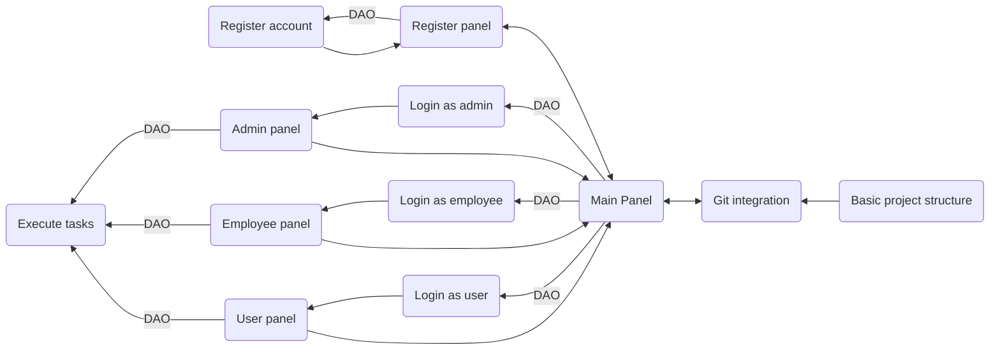

# System design

## Technologies used:
* **Languages used:** JAVA SE
* **Big APIs:** JDBC 
* **Tools:**
    - **Project management:** Notion
    - **Version control:** git
    - **Design:** no tools for design because it is a console application
* **Database:** I used mySql database for working with JDBC API.
* **Design database:**
    
    
## Architecture and design
### **System Architecture**

