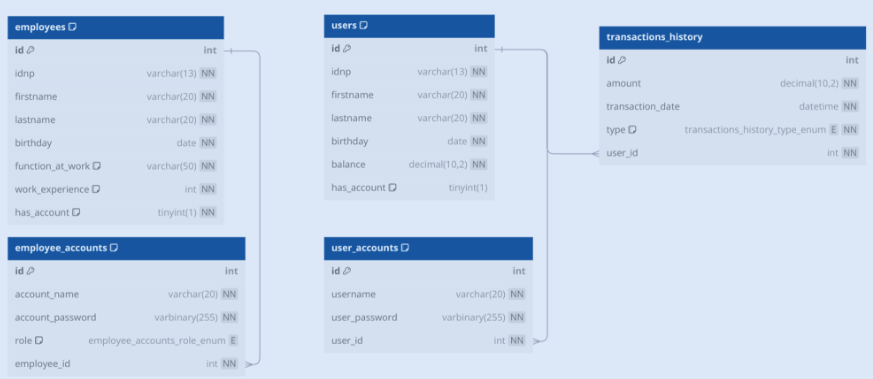
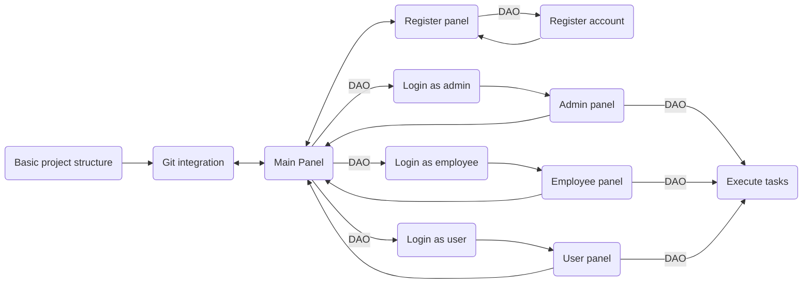

# System design

## Table of contents

### 1. [Introduction](../project-report.md#1-introduction)

### 2. [Objectives](../project-report.md#objectives)

### 3. [Scopes](../project-report.md#scope)

### 4. [Problem Definition](./problem-definition.md)

### 5. [Application Structure](./system-design.md#application-structure)

### 6. [Technologies used](./system-design.md#technologies-used)

### 7. [Architecure and Design](./system-design.md#architecture-and-design)

### 8. [Program screenshots results](./result-screenshoots.md)

---

## Application Structure

### 1. **Roles and Functionality**

**Employee**:

 1. Display my data.
 2. Dismis from work.

**Admin**:

1. Dispaly users.
2. Dispaly employees.
3. Add an user.
4. Add an emplyees.
5. Remove an user.
6. Remove an emplyees.
7. Grant admin privileges to an employee
8. Revoke admin privileges from an employee
9. Display transaction history
   >9.1 certain user.  
   >9.2 For whole bank.

**User**:

1. Display info about me
2. Check my account balance
3. Make a deposit
4. Make a withdrawal
5. Make a transfer to another user
6. Remove my account

---

## Technologies used

* **Languages used:** JAVA SE
* **Big APIs:** JDBC
* **Tools:**
  * **Project management:** Notion
  * **Version control:** git
  * **Design:** no tools for design because it is a console application
* **Database:** I used mySql database for working with JDBC API.
* **Design database:**  

    

---

## Architecture and design

### **System Architecture**

### Design patterns

* **Singleton pattern:** Used in MySql.java for handling centralized connection with the database.
* **DAO pattern:** The UserDAO interface, with other DAO interfaces that may be in the project, will abstract database operations relating to different entities—in this case, users, employees, and transactions.

---
