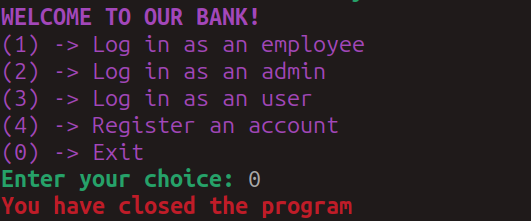

# Bank-Management-System

|Author | Date release | Date End|
|--------|--------------|---------|
Scriba Mihail |   31 aug 2024             |     4 sept 2024    |

## Organization

###  Alpelex

## Absatract

 Below is the console-based banking system implemented in Java, and for database
 interaction, JDBC is used. The aforementioned program will help to maintain a
 bank account along with transactions and users. There are three major roles to
 be precisely explained: User, Employee, and Admin. The sole motive of this below
 project is going to learn and implement concepts of JDBC along with DAO patterns
 for separation of business logic and database respectively.
